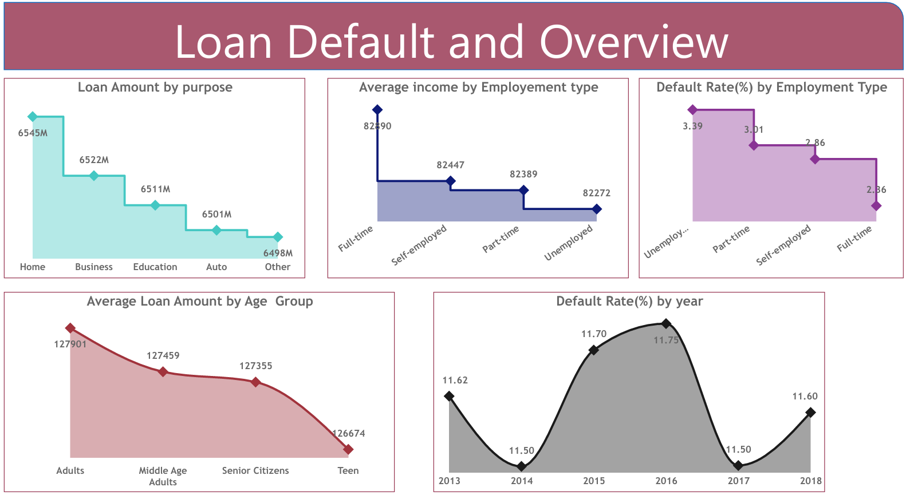
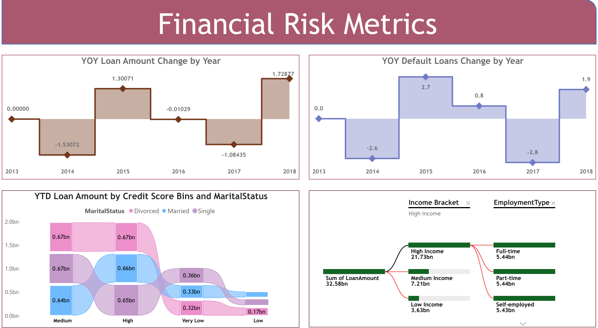
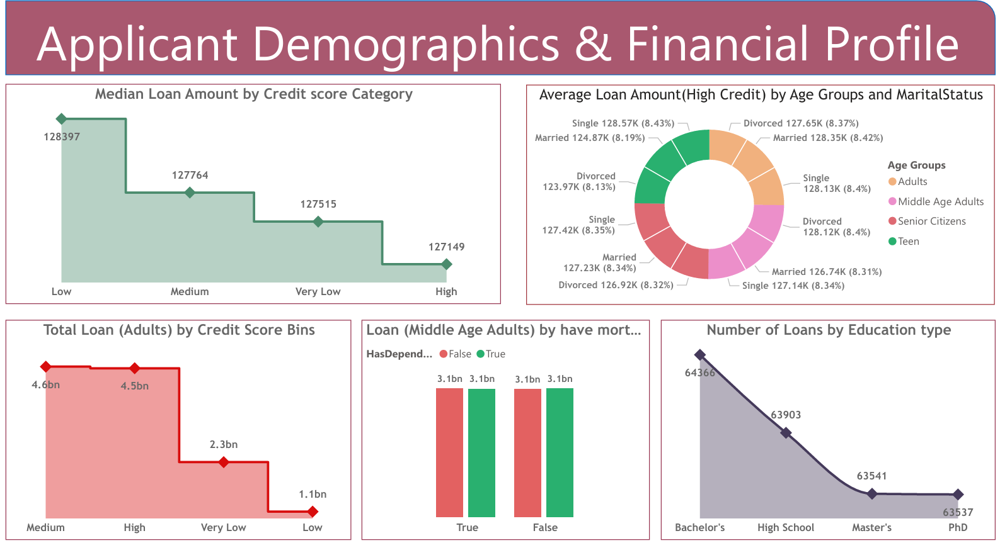

# 📊 Loan Default Risk Analysis Dashboard using Power BI

## 🎯 Problem Statement
Analyze loan data to identify key factors influencing loan defaults and provide actionable insights to support risk assessment and decision-making for financial institutions.

---

## 📌 Project Overview
This project analyzes **loan default behavior** using **Power BI** to uncover patterns in borrower profiles, financial risk, and repayment trends.  
The dataset was extracted from a structured SQL database and transformed using Power Query for analysis.

The dashboard enables stakeholders to:
- Monitor loan performance and default trends  
- Identify high-risk borrower segments  
- Make data-driven credit and lending decisions  

---

## 🛠️ Tools & Technologies
- **SQL** – Data extraction and preprocessing  
- **Power BI** – Data modeling, dashboard development, and reporting  
- **Power Query** – Data cleaning and transformation  
- **DAX** – KPI calculations and advanced analytical measures  

---

## 📈 Key Metrics
- Loan Default Rate  
- Income-to-Loan Ratio  
- Year-over-Year (YOY) Loan Performance  
- Borrower Segmentation Metrics  

---

## 📊 Key Insights
- Higher default rates observed among borrowers with **low credit scores** and **high income-to-loan ratios**  
- **Demographic factors** such as age group, employment type, and marital status significantly influence default risk  
- YOY analysis reveals fluctuations in loan repayment behavior and financial stability trends  
- Interactive dashboards enable filtering by borrower segment, loan type, and time period  

---

## 💡 Business Impact
- Helps financial institutions identify **high-risk customers** and reduce default rates  
- Supports **better credit decision-making** using data-driven insights  
- Enables targeted strategies based on borrower demographics and financial behavior  
- Improves overall loan portfolio performance monitoring  

---

## 📂 Project Structure
loan-default-analysis/
- powerbi/ # Power BI project files (.pbix)
- reports/ # Exported reports (PDF, PNGs)
- loan default data - analysis.pdf
- README.md

---

## 📸 Dashboard Preview

---

## ▶️ How to Use
1. Open the Power BI file (`powerbi/loan_default_dashboard.pbix`) in **Power BI Desktop**  
2. Explore interactive dashboards and slicers  
3. Analyze loan trends and borrower segments  
4. Review the summary report in `reports/loan default data - analysis.pdf`  

---

## 🚀 Key Features
- Interactive dashboard with filters and drill-down capabilities  
- Dynamic KPI tracking using DAX  
- Data cleaning and transformation using Power Query  
- Business-focused insights for risk analysis  

---

## 🙌 Acknowledgements
- Dataset sourced from a structured SQL database containing borrower and loan information  
- Analysis and visualization performed using Power BI  

---

## 👩‍💻 Author
**Harshitha Adicherla**  
- GitHub: https://github.com/harshithaadicherla10
